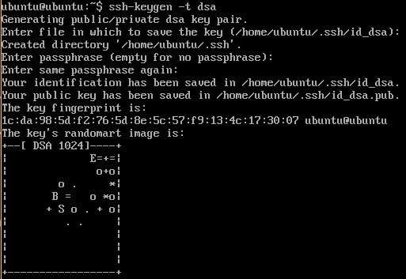
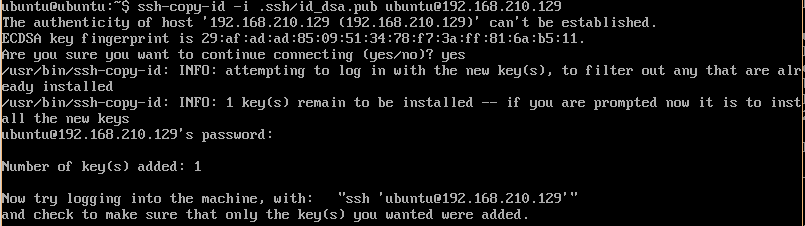
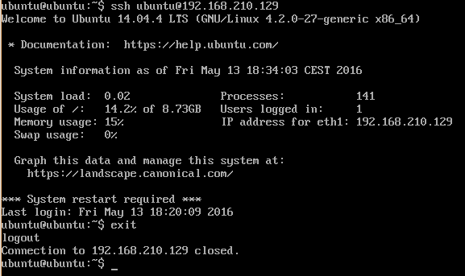

#### Practica 2 - Sincronizacion automatica por _rsync_

Suponemos de tener dos maquinas, M1 y M2, de las cuales la segunda es la que recibe las peticiones del web y la primera la que tiene que actualizarse con las informacciones nuevas de M2. Suponemos que las maquinas sean en la misma red y que puedan comunicar entre ellas.
Quiero conectrame desde la maquina M1 (ubuntu@192.168.210.128) a la maquina M2 (ubuntu@192.168.210.129).
Para hacer esto simplemente tengo que generar la clave publica y enviarla a la M2, y luego ententar la coneccion.

> ssh-keygen -t dsa

> ssh-copy-id -i .ssh/id_dsa.pub ubuntu@192.168.210.129

> ssh 192.168.210.129 -l ubuntu

Luego, se va a intentar la connexion SSH mediante la herramienta _rsync_, la cual antes preguntaba por la contraseña del usuario _ubuntu@192.168.210.129_. Es necesario que la carpeta _/var/www_ tenga permisos de usuario normal, y no de superusuario. Para hacer esto, se usa la orden _sudo chown ubuntu:ubuntu -R /var/www_.

> rsync -avz -e ssh ubuntu@192.168.210.129:/var/www/ /var/www/

Para que esta operacion sea automatica, necesitamos que añadir una entrada a la tabla de cron (con la orden _crontab_). Primero creamos un fichero script que permite de ejecutar la orden precediente de rsync, y lo llamamos _myrsync.sh_; luego, ponemos la ejecucion automatica de dicho script:

