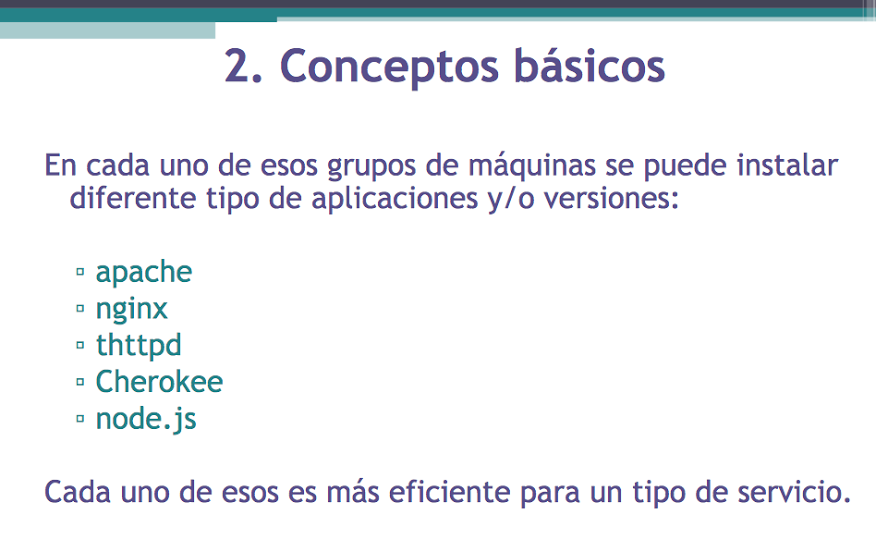

###Ejercicio 1: ¿A que sirven los siguientes servicios?

######Apache
Apache HTTP Server proporciona un servidor web HTTP modular, multi-plataforma y extensible. Es el mas popular y usado entre los servicios HTTP disponibles. Se usa para enviar paginas web estaticas y dinamicas en la Web (HTTP es un protocolo PULL) y para proporcionar acceso a otros servicios (aplicaciones web) que hay en el servidor.
######nginx
Nginx es un servicio para proporcionar acceso distribuido a granja web de servidores de paginas web que reciben muchisimas peticiones cada dia. Proporciona balanceo de carga, tolerancia a fallos, soporte de mas de 10000 conexiones simultaneas, y tambien proporciona un servicio de proxy para correos electronicos.
######lighthttp
Es la version lite de un servidor web HTTP, fundamental para entornos que requieren velocidad de acceso rapida o para cualquier servidor que tenga problemas de carga: consume menos CPU y RAM que otros servidores web.
######Cherokee
Servidor web que permite de soportar conexiones concurrentes, proporciona balanceo de carga y consuma poca memoria. Tiene muchos modulos para extenderlo.
######node.js
Node.js proporciona un servicio de E/S de datos en una arquitectura orientada a los eventos: permite una conexion en tiempo real de dos vias. Se usa para aplicaciones web de tiempo real que usan tecnologias de tipo PUSH a traves de websockets; no sirve para aplicaciones de calculo intensivo, mas bien para aplicaciones web rapidas y escalables. Trabaja con solo un hilo, usando llamadas E/S no-bloqueantes que permiten conexiones concurrentes sin requierir mucha RAM.
######tomcat
Es un contenidor web que soporta _servlets_ y _JavaServer Pages (JSPs)_, usado bien en combinacion con el servidor web _Apache_ o bien por si mismo. Se prefiere el uso de Tomcat con Apache, cuando hay necesidad de ejecutar aplicaciones Java, servlet o JSPs.
