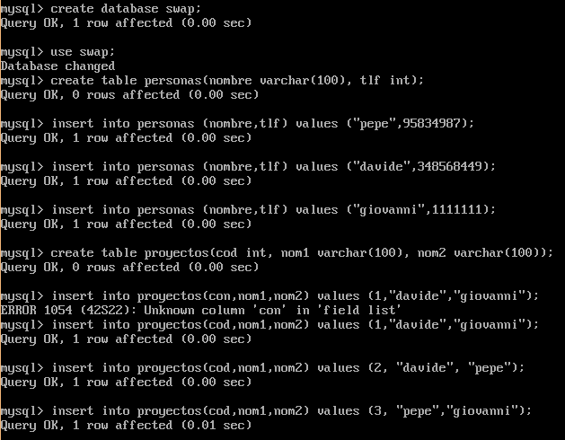
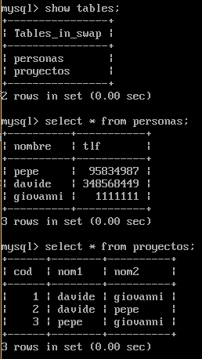

## Practica 5 - Replicación de bases de datos MySQL 

Para esta practica, vamos a realizar la replicacion de una base de datos existente en la maquina _M1@192.168.210.128_ hacia la maquina _M2@192.168.210.129_.

### Seccion 1: creacion de la base de datos

Como primera etapa, instalamos _mysql-server_ en las dos maquinas:

```
sudo apt-get install mysql-server -y
```

Una vez instalado, vamos a crear en la M1 una base de datos de nombre _SWAP_, con dos tablas _personas_ Y _proyectos_ y unas entradas.

```
$ mysql -u root -p
mysql > create database swap;
mysql > use swap;
mysql > create table personas(nombre varchar(100),tlf int);
mysql > insert into personas(nombre,tlf) values ("pepe",95834987);
mysql > insert into personas(nombre,tlf) values ("davide",348568449);
mysql > insert into personas(nombre,tlf) values ("giovanni",11111111);
mysql > create table proyectos(cod int, nombre1 varchar(100),nombre2 varchar2(100));
mysql > insert into proyectos(con,nombre1,nombre2) values (1,"davide","giovanni");
mysql > insert into proyectos(con,nombre1,nombre2) values (2,"davide","pepe");
mysql > insert into proyectos(con,nombre1,nombre2) values (3,"pepe","giovanni");
```



Para comprobar la creacion, podemos ejecutar en mysql los siguientes comandos:

```
mysql > show tables;
mysql > select * from personas;
mysql > select * from proyectos;
```



### Seccion 2: Copia de seguridad por mysqldump

_mysqldump_ es una herramienta proporcionada por mysql para hacer copias de seguridad de bases de datos. Como puede pasar que una BD se estea actualizando en el momiento en el que queremos hacer la copia de seguridad, vamos a cerrar las tablas en lectura y cerrar mysql

```
mysql > FLUSH TABLES WITH READ LOCK;
mysql > quit
```

Ahora, habria que generar un fichero SQL y enviarlo a la maquina M2 de manera que pueda hacer su copia de la BD _swap_. Sin embargo, las maquinas M1 y M2 ya estan conectada por SSH con claves compartidas: de esta manera seria mejor utilizar ssh en un pipe para hacer todo en automatico:

```
$ mysqldump swap -u root -p | ssh ubuntu@192.168.210.129 mysql
```

Importante es desbloquear las tablas de la maquina M1!

```
$ mysql -u root -p

mysql > UNLOCK TABLES;
```