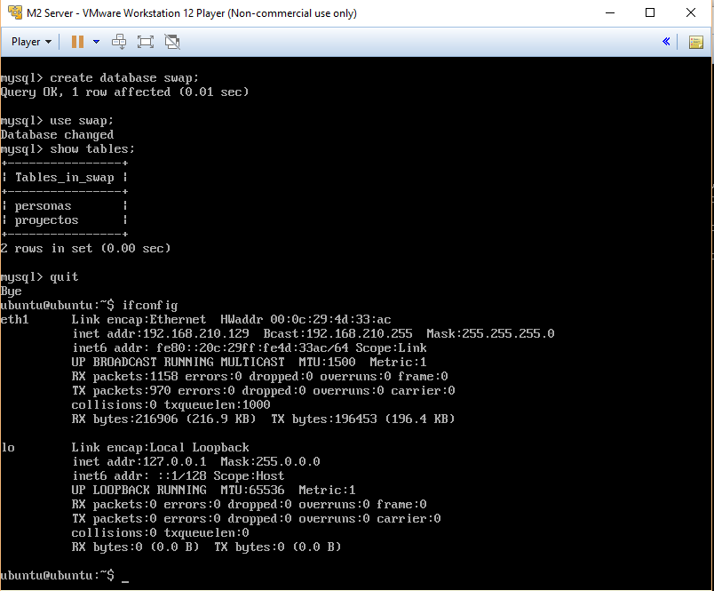
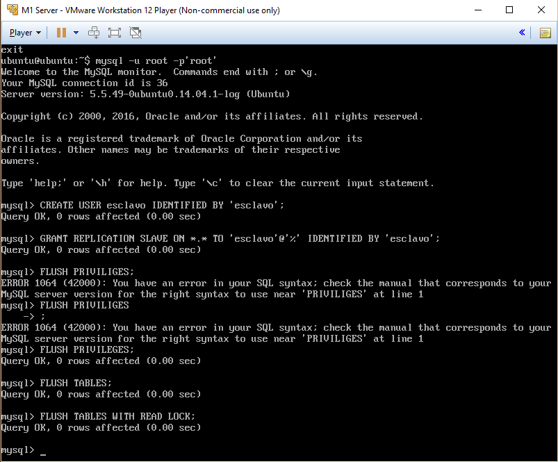

## Practica 5 - Replicación de bases de datos MySQL 

Para esta practica, vamos a realizar la replicacion de una base de datos existente en la maquina _M1@192.168.210.128_ hacia la maquina _M2@192.168.210.129_.

### Seccion 1: creacion de la base de datos

Como primera etapa, instalamos _mysql-server_ en las dos maquinas:

```
sudo apt-get install mysql-server -y
```

Una vez instalado, vamos a crear en la M1 una base de datos de nombre _SWAP_, con dos tablas _personas_ Y _proyectos_ y unas entradas.

```
$ mysql -u root -p
mysql > create database swap;
mysql > use swap;
mysql > create table personas(nombre varchar(100),tlf int);
mysql > insert into personas(nombre,tlf) values ("pepe",95834987);
mysql > insert into personas(nombre,tlf) values ("davide",348568449);
mysql > insert into personas(nombre,tlf) values ("giovanni",11111111);
mysql > create table proyectos(cod int, nombre1 varchar(100),nombre2 varchar2(100));
mysql > insert into proyectos(con,nombre1,nombre2) values (1,"davide","giovanni");
mysql > insert into proyectos(con,nombre1,nombre2) values (2,"davide","pepe");
mysql > insert into proyectos(con,nombre1,nombre2) values (3,"pepe","giovanni");
```


Para comprobar la creacion, podemos ejecutar en mysql los siguientes comandos:

```
mysql > show tables;
mysql > select * from personas;
mysql > select * from proyectos;
```


### Seccion 2: Copia de seguridad por mysqldump

_mysqldump_ es una herramienta proporcionada por mysql para hacer copias de seguridad de bases de datos. Como puede pasar que una BD se estea actualizando en el momiento en el que queremos hacer la copia de seguridad, vamos a cerrar las tablas en lectura y cerrar mysql

```
mysql > FLUSH TABLES WITH READ LOCK;
mysql > quit
```

Ahora, habria que generar un fichero SQL y enviarlo a la maquina M2 de manera que pueda hacer su copia de la BD _swap_. Sin embargo, las maquinas M1 y M2 ya estan conectada por SSH con claves compartidas: de esta manera seria mejor utilizar ssh en un pipe para hacer todo en automatico, despues haber creado en la M2 el database _swap_:

```
$ mysqldump swap -u root -p'root' | ssh 192.168.210.129 mysql -u root -p'root' swap 
```

Importante es desbloquear las tablas de la maquina M1!

```
$ mysql -u root -p

mysql > UNLOCK TABLES;
```



### Seccion 3: Replica de datos automatica, configracion maestro-esclavo

Aunque funcional, la procedura describida en la seccion 2 es manual y intensiva de recursos. Por esto, buscamos una manera automatizada para la que se actualizen las dos bases de datos, sin un operador. Definimos el servidor M1 como Maestro, el donde se actualizan los datos, y la M2 como Esclavo, el que se va a actualizar desde las actualizaciones del M2.

M1@192.168.210.128 --> MAESTRO
M2@192.168.210.129 --> ESCLAVO

#### Seccion 3.1: Configuracion del fichero _my.cnf_
Configuramos por primero el <strong>maestro</strong>, es decir la maquina M1, modificando el fichero _/etc/mysql/my.cnf_ :

0. Establecemos el ID del servidor maestro ``` server-id = 1 ```
1. Comentamos el parámetro bind-address ``` #bind-address 127.0.0.1 ```
2. Indicamos el fichero como log de errores ``` log_error = /var/log/mysql/error.log ```
3. Indicamos el fichero como registro binario ``` log_bin = /var/log/mysql/bin.log ```
4. Reiniciamos mysql ``` /etc/init.d/mysql restart ```

La configuracion del <strong>esclavo</strong> serà igual, si no que el ID del servidor esclavo serà 2.

#### Seccion 3.2: Usuario en M1 con acceso para replicacion

Entramos en mysql e ejecutamos las sentencias:
```
mysql -u root -p'root'
```


#### Seccion 3.3: Status del maestro

Necesitamos de los datos de configuracion del maestro, y ejecutamos en el mysql de M1:

```
mysql > SHOW MASTER STATUS;
```


#### Seccion 3.4: Configuracion del esclavo

Una vez en mysql, tenemos que configurar el entorno de mysql para que actue de esclavo a la M1, gracias a la informaciones sacadas en la seccion 3.3 .


#### Seccion 3.5: Activacion de tablas y comprueba de status

Volvemos al esclavo y activamos la tablas:

```
mysql > UNLOCK TABLES;
```

Comprobamos todos mostrando informaciones en el esclavo:


Comprobamos que hya actualizacion en frente a una modifica en el maestro:


### Seccion 4: Configuracion maestro-maestro

Ahora queremos que las modificas se actualizen en ambos sentidos. Ya està configurado el sentido M1->M2, ahora falta el otro. Para hacer esto, serìa suficiente hacer de manera que la maquina M1 se porte como esclavo para la M2, como hecho por el apartado 3.

1. Creamos un usuario esclavo en la m2, con el que la M1 pueda acceder y replicar


2. En la M1 ahora escalva, damos los datos del nuevo maestro


3. Comprobamos el funcionamento

