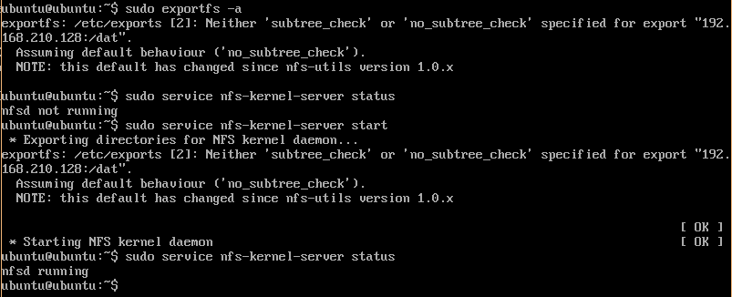
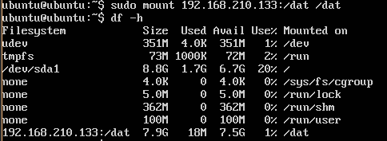

## Practica 6 - Discos en RAID

En esta practica vamos configurando una maquina virtual con dos discos que trabajen en RAID 1, configuracion que ofrece una gran seguridad al replicar los datos en los dos discos. 

### Seccion 1 - Herramienta y configuracion RAID 1

Como primera etapa, agregamos dos discos nuevos SCSI del mismo tamaño que el disco principal.

Instalamos mdadm, software para la configuración de discos duros RAID.

    sudo apt-get install mdadm
    
Con fdisk podemos sacar informaciones de todos los discos.

    sudo fdisk -l 
    

Creamos el raid con los discos no partitionados, y lo montamos en /dat:

    sudo mdadm -C /dev/md0 --level=raid1 --raid-devices=2 /dev/sdb /dev/sdc
    sudo mkfs /dev/md0
    sudo mkdir /dat
    sudo mount /dev/md0 /dat
    sudo mount
    

    
Para comprobar el estado del RAID, ejecutaremos:
    
    sudo mdadm --detail /dev/md0
    

Ahora necesitamos agregar el UUID del disco al fichero _/etc/fstab_ para que el RAID se arranque con el sistema:

    ls -l /dev/disk/by-uuid/
    sudo nano /etc/fstab
    UUID=a3aa6fba-c16c-47d0-8f4f-00b3da9628e9 /dat ext2 defaults 0 0
    

La configuración está ahora completa.

### Sección 2 - Simulación de fallo y retiro "en caliente"

La herramienta _mdadm_ proporciona la posibilidad de simular un fallo en uno de los discos, de manera que se pueda ritirar el disco mientras sea funcionante ("en caliente") y agregar uno nuevo.

Para simular el fallo en el disco _/dev/sdb_ ejecutamos la orden: 

    sudo mdadm --manage --set-faulty /dev/md0 /dev/sdb

Luego podemos retirarlo "en caliente", y agregar un nuevo disco: 

    sudo mdadm --manage --remove /dev/md0 /dev/sdb
    sudo mdadm --manage --add /dev/md0 /dev/sdb
    

Comprobamos el estado final del RAID:

### Sección Opcional: Servidor NFS con RAID

Los conocimientos para hacer esta sección provienen de la web, en particular nos referimos a [este](http://www.ite.educacion.es/formacion/materiales/85/cd/linux/m4/instalacin_y_configuracin_de_nfs.html) enclace.

En esta sección queremos compartir el directorio _/dat/_ previamente creado en la maquina _RAID@192.168.210.133_ con otras maquinas en la misma red, en particular con la _M1@192.168.210.128_. Esto es posible con un servidor NFS. Para poder compartir carpetas en la red mediante NFS, en el PC servidor es necesario instalar el paquete del servidor NFS:

    sudo apt-get install nfs-common nfs-kernel-server
    
Una vez instalado, pasamos a la configuración del servicio NFS, en particular el fichero _/etc/exports/_; en cada linea especificamos la carpeta a compartir, el modo en que se comparte, y a cual PCs se permite el acceso, especificando nombres o rango de IP. Primero, quitamos los permisos especificos del directorio /dat/ en el que hemos montado el RAID, y luego configuramos el fichero _/etc/exports/_:

    sudo chown nobody:nogroup /dat/
    sudo nano /etc/exports
    
Y ponemos:

    /dat 192.168.210.128(rw,sync)
    
Actuamos las modificaciones y arrancamos el servicio nfs-kernel-server:

    sudo exportfs -a
    sudo service nfs-kernel-service start    
    

    
Y comprobamos desde la maquina _M1@192.168.210.128_ que, despues de haber instalado el servicio NFS y de haber montado la carpeta remota, se pueda ver el directorio _/dat/_; en la M1:

    sudo apt-get install nfs-common
    sudo mkdir /dat
    sudo mount 192.168.210.133:/dat /dat
    df -h
    
