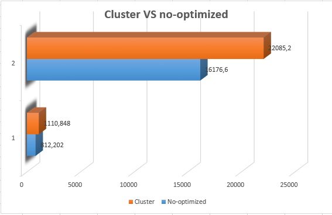

# Node.js : javascript lado servidor

Presentacion hecha por:
- Davide Gallitelli
- Juan Ramon Mossa

## Enclace a las trasparencias

[Transparencias](http://slides.com/davidegallitelli/deck/fullscreen)

## Algunas informacciones generales

Esta presentación es sobre Node.js.

Node.js es una tecnologia que utiliza JavaScript como lenguaje de programación, con el fin de implementar el modelo orientado a eventos asíncronos y programación orientada a objetos de programación.

Esto permite hacer que el software muy flexible y enormemente escalable, de modo que tenga un excelente rendimiento para la mayoría de las aplicaciones de Internet de hoy en día (enorme número de solicitudes, aplicaciones en tiempo real, etc.).

Por otra parte, también puede actuar como software para el desarrollo, proporcionando un buen número de herramientas tales como tareas constructor, compilación y compresión, etc.

## Etapas para instalar un servidor Node.js en Ubuntu

Aqui voy a describir las etapas para instalar un servidor node.js de aplicaciones 
    
    sudo apt-get install git -y
    curl -sL https://deb.nodesource.com/setup_6.x | sudo -E bash -
    sudo apt-get install -y nodejs build-essential
    
Si ya no resulta instalado, instalar _npm_, gestór de paquetes:

    sudo apt-get install npm -y
    
Fundamental, para desarrollar correctamente aplicaciones web sin volver locos con dependencias y inclusiones, es instalar _bower_:

    sudo npm install bower -g
    
Ahora creamos el directorio donde queremos tener nuestra aplicacion, llamada _myapp_:

    mkdir myapp
    cd myapp
    
Y inicializamos el directorio con _npm_ que crearà automaticamente el fichero _myapp/package.json_ con todas la dependencias y detalles de la aplicacion:

    npm init
    
Muy importante en esa etapa es poner un _entry point_ de la aplicacion, cuando eso es pedido por la consola:

    entry point: app.js
    
Para ejecutar la nuestra aplicacion ejecutamos en consola:

    node app.js
    
NB: puede pasar que node no se ponga en el $PATH automaticamente. Si pasa esto, es suficiente ejecutar la orden

    ln -s /usr/bin/nodejs /usr/bin/node
 
### Extra: express y el generador de aplicaciones

Resultaría utíl instalar _express_, framework para aplicaciones web con muchas funcionalidades para crear SPA (Single-Page Applications) y aplicaciones a paginas multiplas o soluciones ibridas.

    npm install express --save
    npm install express

El modulo _express_ proporciona una herramienta de creacion de esqueleto de aplicacion a través de _express-generator_

    npm install express-generator -g
    
Una vez instalado, es suficiente teclar en consola (ejecutar **express -h** para la ayuda de la orden):

    express myapp
    
y _express-generator_ crea automaticamente la estructura de la aplicacion. Ahora ejecutamos las ordenes:

    cd myapp
    npm install 
    DEBUG=myapp:* npm start
    
y será posible ver la aplicacion cargando la dirección [localhost:3000](http://localhost:3000/).

La configuracion por defecto de express-generator es crear un esqueleto de aplicacion basada en _jade_. Si en crear la aplicacion se añade el parametro **-e** o **--ejs**, se pasa el suporto al motor ejs, ideal para _Typescript_ y entonces aprovechar de front-end framework como Angular 2. Para mas detalles, seguir esta [guía](http://goo.gl/d4Wkw5). Buscar también mas informaciones sobre "MEAN Stack", u seguir esta [guía](https://scotch.io/tutorials/setting-up-a-mean-stack-single-page-application).

### Codigo para server HTTP con Node.js puro usado para el benchmarking

    // Setting up vars and requires
    var http = require ('http'),
        express = require('express'),
        app = express();  
        
    // Setting up routes
    app.use(express.static(__dirname + '/public'));
    app.set('views',__dirname+'/views');
    app.set('view engine','ejs');
    app.get('/',function(req,res){
        res.render('index',function(err,html){
            res.send(html);
        })
    });
    http.createServer(app).listen(3000);

### Codigo JS que aprovecha multi-threading [libreria Cluster]

    // Setting up vars and requires
    var cluster = require('cluster'),
        http = require ('http');
        
    // Defining master and workers    
    if (cluster.isMaster) {
        
        // Set up number of CPUs
        var numCPUs = require('os').cpus().length;
        
        // Fork workers.
        for (var i = 0; i < numCPUs; i++) {
            cluster.fork();
        }
        Object.keys(cluster.workers).forEach(function(id) {
            console.log("I am running with ID : "+cluster.workers[id].process.pid);
        });
        cluster.on('exit', function(worker, code, signal) {
            console.log('worker ' + worker.process.pid + ' died');
        });
    } else {
        var express = require('express'),
            app = express();
        
        // Setting up routes
        app.use(express.static(__dirname + '/public'));
        app.set('views',__dirname+'/views');
        app.set('view engine','ejs');
        app.get('/',function(req,res){
            res.render('index',function(err,html){
                res.send(html);
            })
        });
        http.createServer(app).listen(3000);
    }

### Tipo de benchmarking

Se han hechos tests con Siege.
    
### Exito benchmarking

###Como instalar las aplicaciones de las transparencias:

#### Aplicacion de la chat
    wget https://goo.gl/icK23K && sh icK23K && rm icK23K

#### AppCluster
    wget https://goo.gl/oqiG6E && sh oqiG6E && rm oqiG6E