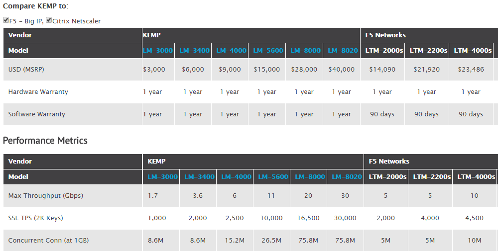

#### Ejercicio 4.1. Buscar información sobre cuánto costaría en la actualidad un mainframe. Comparar precio y potencia entre esa máquina y una granja web de unas prestaciones similares.

Un mainframe básico IBM puede costar alrededor de 75.000 dólares, segun lo que dice [este enlace](http://www.v3.co.uk/v3-uk/analysis/2390692/ibm-s-z13-shows-the-mainframe-still-has-its-place-for-now).

#### Ejercicio 4.2. Buscar información sobre precio y características de balanceadores hardware específicos. Compara las prestaciones que ofrecen unos y otros.

Los balanceadores modernos suelen ofrecer caraceristicas parecidas, balanceando el trafico web, permitiendo NAT y configurando diferentes parametros. Dependiendo del precio, la prestaciones son diferentes:

[Source](https://kemptechnologies.com/compare-kemp-f5-big-ip-citrix-netscaler-hardware-load-balancers/)

#### Ejercicio 4.3. Buscar información sobre los métodos de balanceo que implementan los dispositivos recogidos en el ejercicio 4.2

Cualquier balanceador implementa todos los metodos de balanceo estudiatos. Se puede ver en el enlace del ejercicio 4.2.

#### Ejercicio 4.4. Instala y configura en una máquina virtual el balanceador ZenLoadBalancer.

Una vez descargada y instalada la ISO desde [este link](https://sourceforge.net/projects/zenloadbalancer/files/latest/download) podemos acceder desde otra maquían a su url de administración en https://<ip_address>:444

#### Ejercicio 4.7. Buscar información sobre métodos y herramientas para implementar GSLB.

Hay unas etapas para poder implementar GSLB, a segun de la herramienta que se quiere utilizar. Hai guìas muy detallada para implementar GSLB con NetScaler o tambien Nginx en la red, aunque se pueden reducir en las siguientes etapas: 

1. Tener dos centros de datos en distintas ubicaciones
2. crear una VPN para comunicacion segura entre los servidores
3. configurar un balanceo estandar entre los servidores mas externos de la granja (pueden ser otros balanceadores) de manera que se redireccione al servidor mas cercano