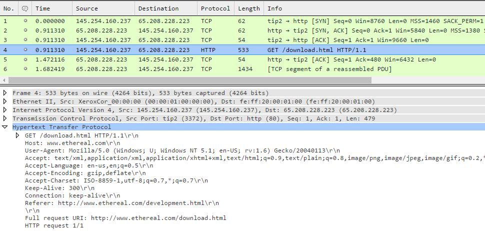

####Ejercicio 5.1: Buscar información sobre cómo calcular el número de conexiones por segundo.

El numero de peticiones serivod por apache en un dicho momento se obtiene con la orden: ```apache2ctl status |grep request```

####Ejercicio 5.2: Instalar wireshark y observar cómo fluye el tráfico de red en uno de los servidores web mientras se le hacen peticiones HTTP.

Instalamos wireshark, empezamos la captura y veremos como fluyen los datos en la ventana, mejor si filtramos con ```port 80``` para ver todas la peticiones HTTP:



####Ejercicio 5.3: Buscar información sobre herramientas para monitorizar las prestaciones de un servidor.

Existen muchas herramientas para monitorizar las prestaciones de un servidor: **RRDTool** y su herramienta grafica web [**Cacti**](http://www.cacti.net/what_is_cacti.php), [**Nagios**](http://www.nagios.org/), [**Munin**](http://munin.projects.linpro.no/), entre los otros.