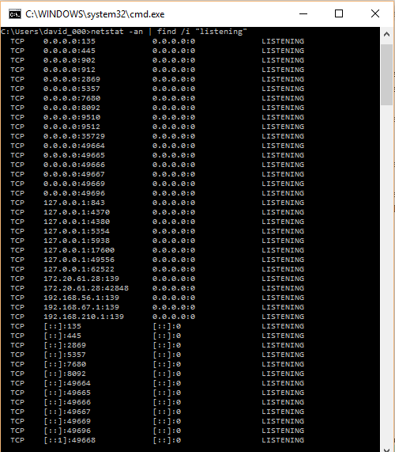

#### Ejercicio 6.2: Comprobar qué puertos tienen abiertos nuestras máquinas, su estado, y qué programa o demonio lo ocupa.

En Windows, es suficiente la orden ```netstat –an ¦find /i “listening”```



#### Ejercicio 6.3: Buscar información acerca de los tipos de ataques más comunes en servidores web, en qué consisten, y cómo se pueden evitar.

SQL Injection: por entradas no "sanitizadas" de campos, como formularios o campos de busqueda

DDoS: Ataque de denegacion de servicio distribudo

XSS: Cross Site Scripting, permitir parsear javascript con codigo malicioso cargado de otro servidor

